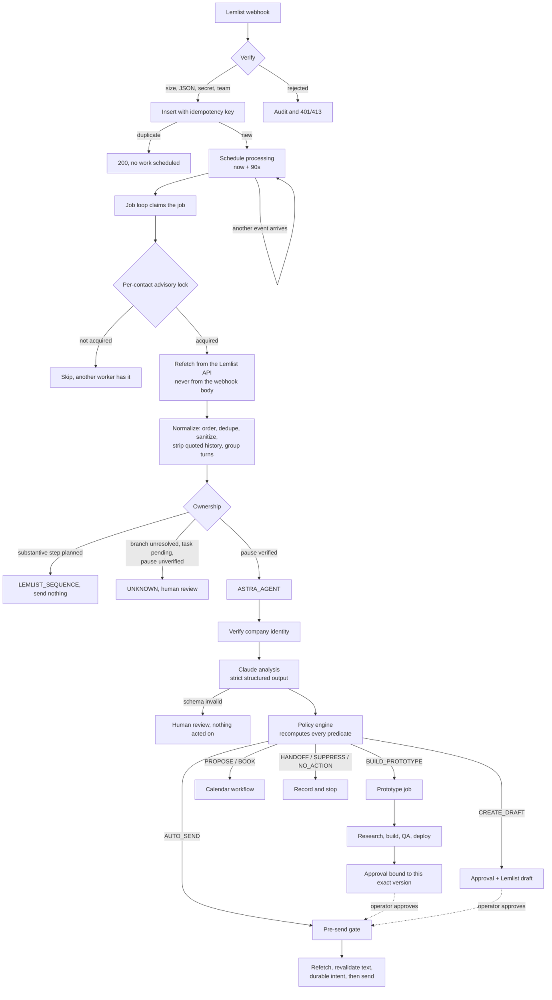
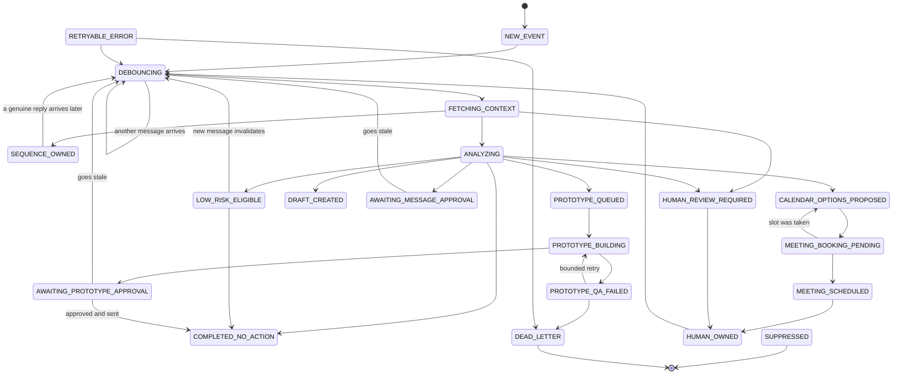
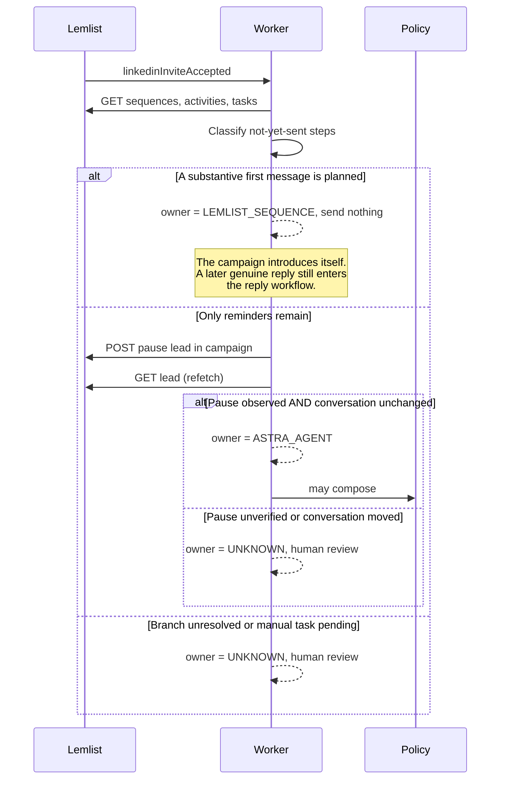

# Data flow and state machine

## From webhook to action

The dotted edges are the only paths by which a prototype URL or a non-
allowlisted message can reach a prospect: through an authenticated operator
approval, and then back through the same pre-send gate.

## Conversation state machine

Every transition not drawn here throws `IllegalStateTransitionError`, is
audited, and rolls back its transaction before any integration is touched. A
controller that has lost track of its own state must not go on to send
anything.

## Ownership after an invitation is accepted

