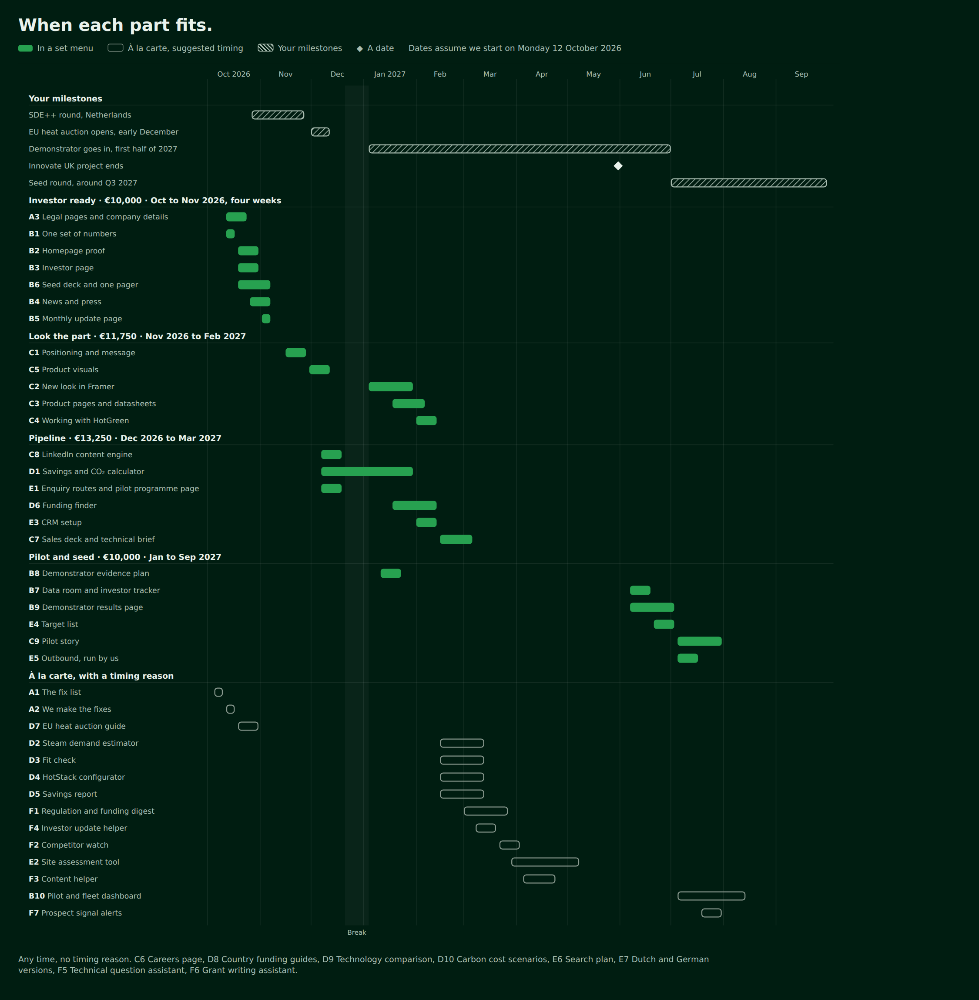
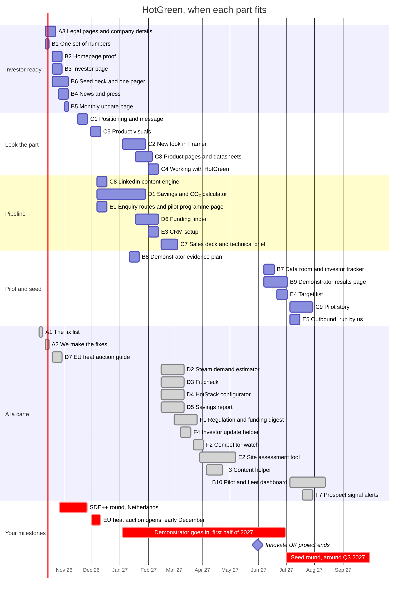

# HotGreen proposal, the merged version. Brief for Josh

Written 28 September 2026 by Raka's Claude session. Nothing in here has been sent to HotGreen. The data
files sit next to this brief in the `superset/` folder, in the repo at `state/hotgreen/proposal/superset/`
or in the zip Raka sent you with this file.

## 0. The job in one paragraph

Turn your menu page at `https://hotgreen.astraagency.nl/` into the one proposal we send HotGreen. Keep
your design, your concept site, your tools and your collateral. Add what Raka's proposal page had and
yours didn't. That means what we analysed and found, a clear card for every item (what it is, what they
get, what changes, days, price, when), four set menus with prices, a Gantt timeline set against
HotGreen's own dates, and who we are. Then fix eleven things on your concept pages that are wrong or
unsupported (section 5). Everything you need is in this file and in `items.json`. You shouldn't need to
ask anyone anything. Where something is unknown, this brief says so and tells you what to put.

**Done means** the checklist in section 9 passes, and you send Raka the URL. Raka reviews it, then
decides when it goes to Sanya and Georgia. Don't send it to HotGreen yourself.

### Files

| File | What it is |
|---|---|
| `items.json` | All 46 items, 4 set menus, 3 monthly options and 5 milestones, with client copy, days, prices, dates and concept links. Load it straight into the page, don't retype it |
| `items.py` | Generates `items.json` and checks every piece of copy against our writing rules. Change a price or a date here, then run `python3 items.py` |
| `gantt-preview.png` and `gantt-preview.html` | What the timeline should look like. Section 6 is the spec |
| `gantt.mmd` | The same timeline as Mermaid, for a quick look |
| `eurostat-*.json` | The raw Eurostat responses behind the calculator's default prices |

## 1. What changes, at a glance

| Your menu page today | The merged page |
|---|---|
| Opens straight on "The menu" | Opens on where HotGreen is, what we analysed and what we found, then the menu |
| Items have a name, a line and a concept link | Every item has what it is, what you get, what changes, days, price and when |
| Three set menus, no prices, "price after the discovery call" | Four set menus with a price each, plus prices on every item |
| No timeline | A Gantt chart set against the SDE++ round, the EU heat auction, the demonstrator and the seed round |
| No team | Raka and you, three pieces of Amwisesa's work and the partner disclosure |
| Eight ideas marked Idea | Kept, with days and prices, as à la carte items |

Your items and Raka's items are merged into six families, A to F, the names Raka chose. Every item
records where it came from (`origin` is Astra, Josh or Both) so nothing either of you proposed was lost.

## 2. The page, top to bottom

Build these sections in this order. Text in a `copy` block goes on the page exactly as written.

### 2.1 Hero

```copy
Prepared for Sanya Chhugani and Georgia Ware
Your proof is stronger than your website.
What we analysed, what we’d build for you, what each part costs and when it fits. Most parts already have a working concept you can open and try.
```

Buttons, "See what we found" (to 2.3) and "See the menu" (to 2.5). Keep your jump chips and change them to
"What we found", "The menu", "Set menus", "Timeline", "Prices", "Who we are".

### 2.2 Where you are

Heading and three short cards, the same as Raka's page.

```copy
Investors first. Customers are already coming in.
Seed round, planned for around Q3 2027
First unit goes into a Coca-Cola Europacific Partners site in the first half of 2027
“a very credible and reliable equipment provider rather than a startup”
How you want HotGreen to come across, from our call on 24 September
```

### 2.3 What we analysed

Six small cards in a grid. Icons are fine, no photos.

```copy
We read everything public about HotGreen.
More than 100 sources, from your own website to Companies House. Every fact on this page was checked against its source.
Your website
Home, Solutions and Contact, on a laptop and a phone, page by page.
Your public record
Companies House filings, the UKRI grant record and CCEP’s 2025 annual report.
What others say about you
Empirical Ventures, Tech.eu, Vestbee and your LinkedIn posts.
Your market
The UK emissions trading register, EU and Dutch funding rules, and official energy prices for six countries.
Your competitors
The websites of 14 companies selling industrial heat pumps and electric steam.
Our call
What you told us on 24 September.
```

### 2.4 What we found

Five findings. Number them 01 to 05. Each has a short title and two or three sentences.

```copy
Your best proof isn’t on your website.
Your proof lives on other people’s sites.
CCEP’s 2025 annual report names HotGreen as one of three startups it invested in. UKRI lists your Innovate UK grant to install and test a 50 kW heat pump at a CCEP site. Empirical Ventures, Tech.eu and Vestbee covered the £1.2m raise, and Ponderosa Ventures joined in June. Your homepage shows your backers as logos with no names, and doesn’t mention the raise, the grant or the demonstrator.
One claim, three numbers.
Your energy saving is 30% on your Solutions page, 40% “compared to competitors” on LinkedIn and up to 50% in Empirical’s announcement. The yearly saving is €250k for a typical facility on your site and $250,000 per MW on LinkedIn.
Your specs sit inside one image.
The HotStack 120 and 220 table on your Solutions page is a picture, so an engineer can’t search it or copy from it.
The business case changes with the country.
At a COP of 2.8, a HotStack costs less to run than a gas boiler when electricity costs less than about 3.3 times the price of gas. That ratio varies a lot from country to country, so the calculator has to run on your own model, per country, with every assumption shown.
The next twelve months are full of openings.
The Dutch SDE++ round runs from 27 October to 26 November with €8bn, and industrial heat pumps from 500 kWth qualify. The EU’s €1bn heat auction is expected to open in early December, and heat pumps with a COP of at least 1.5 get a 25% bonus when bids are ranked. Your demonstrator goes in during the first half of 2027, and the seed round follows around Q3.
```

Sources for every sentence are in Appendix A. Don't add numbers that aren't here.

### 2.5 The menu

```copy
What we’d build, part by part.
Each item says what it is, what you get, what changes for you, how long it takes and what it costs. Most have a working concept you can open.
```

Six family blocks, A to F, from `items.json` `families`. Inside each, one card per item. A card shows

- the code and name, for example "B2 Homepage proof"
- `what` as the one line under the name
- "What you get" then `get`
- "What changes" then `changes`
- a small facts row, `{days} days of work`, `€{price}`, and the month or months from `windows` (write
  "Any time" when `windows` is empty. When `price_eur` is 0, show only "Free" and no days)
- a set menu tag when `set_menu` is set, for example "In Investor ready"
- "Open the concept" for each entry in `links`. Links to `astra-hotgreen-proposal.netlify.app/img/ex/`
  are our example screens. Open them in your lightbox or a new tab
- your "+ Add to shortlist" button
- when `links` is empty, your "Idea" tag and "We can sketch this for you" instead of a concept button

Keep cards compact. Show `what`, the facts row and the buttons by default, and put "What you get" and
"What changes" behind one "Details" toggle. That's the same two levels Raka's page used, and it keeps 46
cards readable. The `note_for_josh` field is for you only, never on the page. Once you've built the two
new pages in section 7, point the B5 and C4 links at them in `items.py` and run it again.

The families and their item lists are generated below, so they match `items.json`.

**A. We fix it.** Fixes to your current website.

| Code | Item | Days | Price | When | Set menu | Concept | From |
|---|---|---|---|---|---|---|---|
| A1 | The fix list |  | Free | 5 to 9 Oct 2026 | À la carte | [The fix list](https://astra-hotgreen-proposal.netlify.app/fixes) | Astra |
| A2 | We make the fixes | 2 | €1,000 | 12 to 16 Oct 2026 | À la carte | [Spec table as text](https://hotgreen.astraagency.nl/site/solutions) | Both |
| A3 | Legal pages and company details | 2 | €1,000 | 12 to 23 Oct 2026 | Investor ready | [Privacy policy](https://hotgreen.astraagency.nl/site/privacy), [Cookie policy](https://hotgreen.astraagency.nl/site/cookies) | Both |

**B. Investor proof.** A website update for investors.

| Code | Item | Days | Price | When | Set menu | Concept | From |
|---|---|---|---|---|---|---|---|
| B1 | One set of numbers | 2 | €1,000 | 12 to 16 Oct 2026 | Investor ready | [Example screen](https://astra-hotgreen-proposal.netlify.app/img/ex/numbers.webp) | Both |
| B2 | Homepage proof | 4 | €1,750 | 19 to 30 Oct 2026 | Investor ready | [Home](https://hotgreen.astraagency.nl/site) | Both |
| B3 | Investor page | 3 | €1,250 | 19 to 30 Oct 2026 | Investor ready | [Investors](https://hotgreen.astraagency.nl/site/investors) | Both |
| B4 | News and press | 3 | €1,250 | 26 Oct to 6 Nov 2026 | Investor ready | [News](https://hotgreen.astraagency.nl/site/news) | Both |
| B5 | Monthly update page | 2 | €1,000 | 2 to 6 Nov 2026 | Investor ready | [Example screen](https://astra-hotgreen-proposal.netlify.app/img/ex/monthly.webp) | Astra |
| B6 | Seed deck and one pager | 6 | €2,750 | 19 Oct to 6 Nov 2026 | Investor ready | [Seed deck](https://hotgreen.astraagency.nl/collateral/deck), [One pager](https://hotgreen.astraagency.nl/collateral/one-pager) | Josh |
| B7 | Data room and investor tracker | 3 | €1,250 | 7 to 18 Jun 2027 | Pilot and seed | [Example screen](https://astra-hotgreen-proposal.netlify.app/img/ex/dataroom.webp) | Both |
| B8 | Demonstrator evidence plan | 2 | €1,000 | 11 to 22 Jan 2027 | Pilot and seed | [Example screen](https://astra-hotgreen-proposal.netlify.app/img/ex/evidence.webp) | Astra |
| B9 | Demonstrator results page | 3 | €1,250 | 7 Jun to 2 Jul 2027 | Pilot and seed | [Example screen](https://astra-hotgreen-proposal.netlify.app/img/ex/evidence.webp) | Astra |
| B10 | Pilot and fleet dashboard | 10 | €4,500 | 5 Jul to 13 Aug 2027 | À la carte | [Dashboard](https://hotgreen.astraagency.nl/tools/dashboard) | Josh |

**C. Increase your credibility.** Branding and a website redesign.

| Code | Item | Days | Price | When | Set menu | Concept | From |
|---|---|---|---|---|---|---|---|
| C1 | Positioning and message | 5 | €2,250 | 16 to 27 Nov 2026 | Look the part | [Example screen](https://astra-hotgreen-proposal.netlify.app/img/ex/positioning.webp) | Astra |
| C2 | New look in Framer | 10 | €4,500 | 4 to 29 Jan 2027 | Look the part | [The concept site](https://hotgreen.astraagency.nl/site) | Both |
| C3 | Product pages and datasheets | 6 | €2,750 | 18 Jan to 5 Feb 2027 | Look the part | [Solutions](https://hotgreen.astraagency.nl/site/solutions) | Both |
| C4 | Working with HotGreen | 2 | €1,000 | 1 to 12 Feb 2027 | Look the part | [Example screen](https://astra-hotgreen-proposal.netlify.app/img/ex/working.webp) | Astra |
| C5 | Product visuals | 3 | €1,250 | 30 Nov to 11 Dec 2026 | Look the part | [How it works](https://hotgreen.astraagency.nl/site) | Josh |
| C6 | Careers page | 1 | €500 | Any time | À la carte | [Careers](https://hotgreen.astraagency.nl/site/careers) | Josh |
| C7 | Sales deck and technical brief | 6 | €2,750 | 15 Feb to 5 Mar 2027 | Pipeline | [Sales deck](https://hotgreen.astraagency.nl/collateral/sales-deck) | Josh |
| C8 | LinkedIn content engine | 4 | €1,750 | 7 to 18 Dec 2026 | Pipeline | [Carousels](https://hotgreen.astraagency.nl/collateral/carousels), [Posts](https://hotgreen.astraagency.nl/collateral/posts) | Both |
| C9 | Pilot story | 8 | €3,500 | 5 to 30 Jul 2027 | Pilot and seed | [Social images](https://hotgreen.astraagency.nl/collateral/social) | Josh |

**D. Let prospects and investors see the proof.** Business case tools on your website.

| Code | Item | Days | Price | When | Set menu | Concept | From |
|---|---|---|---|---|---|---|---|
| D1 | Savings and CO₂ calculator | 8 | €3,500 | 7 Dec 2026 to 29 Jan 2027 | Pipeline | [Calculator](https://hotgreen.astraagency.nl/tools/calculator) | Both |
| D2 | Steam demand estimator | 2 | €1,000 | 15 Feb to 12 Mar 2027 | À la carte | [Estimator](https://hotgreen.astraagency.nl/tools/estimator) | Josh |
| D3 | Fit check | 2 | €1,000 | 15 Feb to 12 Mar 2027 | À la carte | [Fit check](https://hotgreen.astraagency.nl/tools/fit-check) | Josh |
| D4 | HotStack configurator | 3 | €1,250 | 15 Feb to 12 Mar 2027 | À la carte | [Configurator](https://hotgreen.astraagency.nl/tools/configurator) | Josh |
| D5 | Savings report | 4 | €1,750 | 15 Feb to 12 Mar 2027 | À la carte | [Report](https://hotgreen.astraagency.nl/tools/report) | Josh |
| D6 | Funding finder | 5 | €2,250 | 18 Jan to 12 Feb 2027 | Pipeline | [Example screen](https://astra-hotgreen-proposal.netlify.app/img/ex/funding.webp) | Both |
| D7 | EU heat auction guide | 2 | €1,000 | 19 to 30 Oct 2026 | À la carte | [Example screen](https://astra-hotgreen-proposal.netlify.app/img/ex/auction.webp) | Astra |
| D8 | Country funding guides | 3 | €1,250 | Any time | À la carte | Idea | Both |
| D9 | Technology comparison | 2 | €1,000 | Any time | À la carte | Idea | Josh |
| D10 | Carbon cost scenarios | 3 | €1,250 | Any time | À la carte | Idea | Josh |

**E. Optimise your inbound and outbound flow.** Website forms, a CRM and outreach.

| Code | Item | Days | Price | When | Set menu | Concept | From |
|---|---|---|---|---|---|---|---|
| E1 | Enquiry routes and pilot programme page | 3 | €1,250 | 7 to 18 Dec 2026 | Pipeline | [Contact](https://hotgreen.astraagency.nl/site/contact), [Pilot programme](https://hotgreen.astraagency.nl/site/pilot) | Both |
| E2 | Site assessment tool | 10 | €4,500 | 29 Mar to 7 May 2027 | À la carte | [Example screen](https://astra-hotgreen-proposal.netlify.app/img/ex/assessment.webp) | Astra |
| E3 | CRM setup | 4 | €1,750 | 1 to 12 Feb 2027 | Pipeline | [Example screen](https://astra-hotgreen-proposal.netlify.app/img/ex/tracker.webp) | Both |
| E4 | Target list | 4 | €1,750 | 21 Jun to 2 Jul 2027 | Pilot and seed | [Example screen](https://astra-hotgreen-proposal.netlify.app/img/ex/targets.webp) | Astra |
| E5 | Outbound, run by us | 3 | €1,250 | 5 to 16 Jul 2027 | Pilot and seed | [Example screen](https://astra-hotgreen-proposal.netlify.app/img/ex/outbound.webp) | Astra |
| E6 | Search plan | 3 | €1,250 | Any time | À la carte | Idea | Josh |
| E7 | Dutch and German versions | 6 | €2,750 | Any time | À la carte | Idea | Josh |

**F. AI helpers.** AI tools that do the weekly reading and drafting.

| Code | Item | Days | Price | When | Set menu | Concept | From |
|---|---|---|---|---|---|---|---|
| F1 | Regulation and funding digest | 4 | €1,750 | 1 to 26 Mar 2027 | À la carte | [Example screen](https://astra-hotgreen-proposal.netlify.app/img/ex/digest.webp) | Astra |
| F2 | Competitor watch | 3 | €1,250 | 22 Mar to 2 Apr 2027 | À la carte | [Example screen](https://astra-hotgreen-proposal.netlify.app/img/ex/watch.webp) | Astra |
| F3 | Content helper | 4 | €1,750 | 5 to 23 Apr 2027 | À la carte | [Example screen](https://astra-hotgreen-proposal.netlify.app/img/ex/content.webp) | Both |
| F4 | Investor update helper | 2 | €1,000 | 8 to 19 Mar 2027 | À la carte | [Example screen](https://astra-hotgreen-proposal.netlify.app/img/ex/update.webp) | Astra |
| F5 | Technical question assistant | 5 | €2,250 | Any time | À la carte | Idea | Josh |
| F6 | Grant writing assistant | 4 | €1,750 | Any time | À la carte | Idea | Josh |
| F7 | Prospect signal alerts | 4 | €1,750 | 19 to 30 Jul 2027 | À la carte | Idea | Astra |


### 2.6 Set menus

```copy
Or start with a set menu.
Four sprints, in order. Each one stands on its own, and each one builds on the one before.
```

| Set menu | For | When | Items | Days | Price |
|---|---|---|---|---|---|
| Investor ready (recommended start) | For the raise | Oct to Nov 2026, four weeks | A3, B1, B2, B3, B6, B4, B5 | 22 | €10,000 |
| Look the part | For buyers and investors | Nov 2026 to Feb 2027 | C1, C5, C2, C3, C4 | 26 | €11,750 |
| Pipeline | For plant leads | Dec 2026 to Mar 2027 | C8, D1, E1, D6, E3, C7 | 30 | €13,250 |
| Pilot and seed | For the demonstrator and the seed round | Jan to Sep 2027 | B8, B7, B9, E4, C9, E5 | 23 | €10,000 |

The line under each set menu name.

```copy
Investor ready
For the raise. Oct to Nov 2026, four weeks.
Make the proof investors look for easy to find, with one set of numbers behind it.
€10,000
Look the part
For buyers and investors. Nov 2026 to Feb 2027.
Look like the equipment supplier you are, on the site and in every document.
€11,750
Pipeline
For plant leads. Dec 2026 to Mar 2027.
Turn interest from plants into enquiries you can count and follow up.
€13,250
Pilot and seed
For the demonstrator and the seed round. Jan to Sep 2027.
Collect the demonstrator evidence, tell the story when it’s in, and get ready for the seed round.
€10,000
```

Mark Investor ready as "Recommended start", as you did for Seed-Ready. Under the four cards, two more
lines.

```copy
The smallest start is B1, B2 and B3 for €4,000. One set of numbers, the homepage proof and the investor page.
The fix list is free, whichever parts you choose.
```

Then the monthly options, as three small cards.

```copy
Care, €650 a month
Keeps the calculator, the funding finder and the AI helpers running and up to date, plus small changes to the site.
Content, €650 a month
The monthly thirty minute interview turned into a month of LinkedIn posts.
Outbound, €1,300 a month
Campaigns to screened sites, written and run by us.
```

### 2.7 Timeline

```copy
When each part fits.
Dates assume we start on Monday 12 October 2026. If the start moves, every bar moves with it.
```

The Gantt chart, per section 6.

### 2.8 Prices at a glance

One plain table of all 46 items, grouped by family, columns Code, Item, Days, Price, When. Generate it
from `items.json`. Under it

```copy
Prices exclude VAT. We agree the final scope on a call before we start, and nothing starts without your written go ahead.
```

### 2.9 How we work, and what we'd need from you

Keep your four "How we work" cards with these replacements, because the monthly options are a kind of
retainer and hyphens break our rules.

```copy
Build once, run in house.
We do the hard parts, and your team keeps them running.
Fixed scope per sprint
No lock in. We agree scope and price before we start, and the monthly options stop any month.
We build the hard parts once
Design, code, systems and templates, so your team can run them.
You own everything
Pages, CMS collections, templates, playbooks and AI prompts, with an hour of training at the end of every sprint.
Confidential by default
We sign your NDA before we receive technical material. Nothing with the CCEP name goes live without approval.
```

Then Raka's "What we'd need from you" box, word for word.

```copy
What we’d need from you
Your business case model, or the inputs behind it
Thirty minutes with an engineer to agree the numbers
Access to Framer and your brand guidelines
What you can say in public about CCEP, the demonstrator and your investors
```

### 2.10 Who we are

Word for word from Raka's approved page. Images are live on our Netlify site, copy them into your
project. `https://astra-hotgreen-proposal.netlify.app/img/w-pertamina.jpg`, `.../img/w-worldbank.jpg`,
`.../img/w-bango.jpg`.

```copy
Astra and Amwisesa build it as one team.
The team behind Astra has shipped for Unilever, Pertamina and the World Bank. Astra runs the strategy and the project from the Netherlands, and Amwisesa, our development partner, builds.
Pertamina, drilling engineering app
470 drilling engineering formulas rebuilt as a phone calculator that works offline, for engineers on offshore rigs.
World Bank, stunting monitoring
An app and dashboard for the World Bank and a national ministry that collects child health data across a whole country, online or offline.
Unilever, Bango app
A street food finder for Unilever’s Bango brand on iPhone, Android and BlackBerry. It won Gold for Mobile App and Best in Show at the 2015 MMA Smarties.
Built by Amwisesa, Astra’s development partner, often through the brand’s own agency. Screens are from Amwisesa’s credentials.
Raka Mulya
Go to market architect and entrepreneur
Led global ebusiness data and insights at Heineken across 23 markets, and ran global go to market for Betty Blocks, the low code platform. Now runs sales and channel operations at efficy, a European CRM company. He also founded a stroopwafel brand from nothing and scaled it. Your contact at Astra.
Joshua van Zeelt
Founder of Astra Agency and JML Agency
Builds custom websites, software and apps from the first conversation to launch. Studied artificial intelligence at VU Amsterdam and holds an MSc in Strategic Entrepreneurship from RSM Erasmus. Spent seven years coordinating projects at Schiphol, where he helped develop an asset app that forecasts maintenance.
```

Image alt text, in order. "Two screens from the Pertamina drilling calculator app", "The eHDW dashboard with
village counts and service scores", "The Bango app on three phones, with a map of nearby street food stalls".
LinkedIn links, `https://www.linkedin.com/in/raka-mulya-b92885196/` and `https://www.linkedin.com/in/joshua-van-zeelt/`.
The disclosure line always travels with the three pieces of work. Don't drop it.

### 2.11 Next step

```copy
Pick your parts on a thirty minute call.
Add items or a set menu to your shortlist, then send it to us. We’ll confirm the scope, the price and the dates for each part.
```

The send button opens an email to `rifqiraka234@gmail.com`, subject "HotGreen proposal", body "Hi Raka," then
a blank line, "These are the parts we'd like to talk about." and one line per shortlisted item or set menu,
for example "B2 Homepage proof, €1,750". Raka's page did this with a `mailto` link, and it's fine to do
the same. Keep your "All concepts" list under it.

Footer, replacing "Frontend only: forms do not send data."

```copy
Concept work by Astra Agency for HotGreen Solutions. Confidential. Forms on the concept pages don’t send data yet.
```

## 3. The price rule

Every item is priced at its days of work times €450, rounded to the nearest €250, excluding VAT. €450 sits
between our internal day rates for development and for strategy and design. Set menus are the sum of
their items, no discount. The four set menus together come to €45,000, all 46 items to €80,500. If Raka
changes a price or a day count, change it in `items.py`, run it, and the JSON and the checks update
together. Don't edit prices by hand in the page.

## 4. The items in full

Every item's client copy, generated from `items.json`. This is what goes on the cards.

### A. We fix it

**A1 The fix list**. Free, Oct 2026, à la carte.
```copy
The fix list
Twelve fixes to your current site, two of them legal.
What you get
The list, checked on your live site on 25 September 2026, with what to change and where.
What changes
You can make the quick fixes yourselves this week.
```
Note for you, not for the page. Free. Port the twelve items from Appendix C. Recheck each one on the live site the day the page ships, Sanya planned to fix titles and SEO herself.

**A2 We make the fixes**. 2 days, €1,000, Oct 2026, à la carte.
```copy
We make the fixes
We make the twelve fixes in your Framer site.
What you get
Titles, alt text, headings, the spec table as real text, structured data for search, and analytics set up.
What changes
Search engines and screen readers can read every page, and nobody at HotGreen spends an afternoon on it.
```
Note for you, not for the page. Your Foundation fixes, minus the legal pages, which are now A3. Optional, Sanya said she would try the quick fixes herself.

**A3 Legal pages and company details**. 2 days, €1,000, Oct 2026, in Investor ready.
```copy
Legal pages and company details
The pages a UK company website needs.
What you get
A privacy notice linked from every form, a cookie policy and banner, website terms, an accessibility statement, and your company details in the footer. Drafts for your lawyer to approve.
What changes
The two legal gaps on the fix list are closed.
```
Note for you, not for the page. Your Legal drafts. Fill the company number and registered office from Appendix B.

### B. Investor proof

**B1 One set of numbers**. 2 days, €1,000, Oct 2026, in Investor ready.
```copy
One set of numbers
A shared fact sheet.
What you get
Every public figure agreed once with your engineers, with its basis and date written beside it. The site, the decks, LinkedIn and the calculator all use it.
What changes
Three savings figures become one, with its basis.
```
Note for you, not for the page. Your Numbers sheet. It has no concept page yet, link our screen or build one.

**B2 Homepage proof**. 4 days, €1,750, Oct 2026, in Investor ready.
```copy
Homepage proof
A new homepage story.
What you get
Your backers named in words, a dated timeline from founding to first deliveries, and how the HotStack works in one diagram.
What changes
An investor finds the technology, the traction and the company without leaving the page.
```
Note for you, not for the page. Your Website upgrade, homepage part. Apply the milestone fixes in section 5.

**B3 Investor page**. 3 days, €1,250, Oct 2026, in Investor ready.
```copy
Investor page
A page just for investors, with a request form.
What you get
Who backs you, your stage, the investment case, and a form that goes straight to Georgia. The deck goes out on request.
What changes
Investors get their own route instead of the form everyone shares.
```

**B4 News and press**. 3 days, €1,250, Oct to Nov 2026, in Investor ready.
```copy
News and press
A news page and a press kit.
What you get
Every article about HotGreen so far, approved company facts, logos and photos, and a press contact.
What changes
The coverage that already exists lives on your own site.
```

**B5 Monthly update page**. 2 days, €1,000, Nov 2026, in Investor ready.
```copy
Monthly update page
A public version of Georgia’s monthly investor email.
What you get
A page and a short template. Each month the private email gets a short public post.
What changes
A dated post every month from now to the seed round, taken from an email she already writes.
```
Note for you, not for the page. New to your site. Build a concept page at /site/updates in the same style as News.

**B6 Seed deck and one pager**. 6 days, €2,750, Oct to Nov 2026, in Investor ready.
```copy
Seed deck and one pager
Your investor deck in your brand.
What you get
A seed deck with an editable master, a one page investor summary and a short update deck.
What changes
Every investor document tells the same story with the same numbers.
```
Note for you, not for the page. Your Deck design.

**B7 Data room and investor tracker**. 3 days, €1,250, Jun 2027, in Pilot and seed.
```copy
Data room and investor tracker
A seed data room with tracked access.
What you get
Folders and an index ready for your lawyers and accountants to fill, a simple investor tracker and an update template.
What changes
Diligence runs from one link, and you see which investor read what.
```
Note for you, not for the page. Our Data room plus your Investor ops.

**B8 Demonstrator evidence plan**. 2 days, €1,000, Jan 2027, in Pilot and seed.
```copy
Demonstrator evidence plan
What each approver needs to see from the demonstrator.
What you get
Before the install, a one page list per approver, from engineering to finance, of the data to collect.
What changes
The demonstrator collects the evidence investors and buyers will ask for.
```

**B9 Demonstrator results page**. 3 days, €1,250, Jun to Jul 2027, in Pilot and seed.
```copy
Demonstrator results page
The results page, once the unit runs.
What you get
A page with the results each approver asked for, with live data if CCEP agrees.
What changes
Anyone signing off an order or an investment sees the evidence in one place.
```
Note for you, not for the page. Starts when the first data arrives. The bar is a planning estimate.

**B10 Pilot and fleet dashboard**. 10 days, €4,500, Jul to Aug 2027, à la carte.
```copy
Pilot and fleet dashboard
A live dashboard for installed units.
What you get
COP, uptime and CO₂ avoided per site, a private view for the data room and a public highlights view.
What changes
Every installed HotStack keeps proving itself.
```
Note for you, not for the page. Shown with simulated data, keep saying so.

### C. Increase your credibility

**C1 Positioning and message**. 5 days, €2,250, Nov 2026, in Look the part.
```copy
Positioning and message
A workshop and a short message guide.
What you get
One clear line on what HotGreen makes and who it’s for, the proof ranked behind it, and the mission on top. Built from your brand guidelines.
What changes
Every page, deck and post tells the same story.
```
Note for you, not for the page. Run with Luna, per the debrief. Do not name Luna in client copy unless Raka says so.

**C2 New look in Framer**. 10 days, €4,500, Jan 2027, in Look the part.
```copy
New look in Framer
A redesign of the pages you choose.
What you get
New layouts built inside your Framer site, from the concept pages you’ve seen here. You keep editing them yourselves.
What changes
The site looks like the equipment supplier you are.
```
Note for you, not for the page. Your whole concept site is the example for this item.

**C3 Product pages and datasheets**. 6 days, €2,750, Jan to Feb 2027, in Look the part.
```copy
Product pages and datasheets
A page and a datasheet for each HotStack model.
What you get
HotStack 120 and 220 pages with the specs as real text, a PDF datasheet each, and a page per application, pasteurisation, brewing, distillation, drying and sterilisation.
What changes
A plant engineer can read, search and download the specs, which today sit inside one image.
```

**C4 Working with HotGreen**. 2 days, €1,000, Feb 2027, in Look the part.
```copy
Working with HotGreen
A page for procurement teams.
What you get
Company details, the warranty and service approach, spares, the certification route and how an install runs.
What changes
Finance, legal and procurement find their answers before they need a call.
```
Note for you, not for the page. New to your site. Build a concept page at /site/working-with-us.

**C5 Product visuals**. 3 days, €1,250, Nov to Dec 2026, in Look the part.
```copy
Product visuals
Two diagrams you can use everywhere.
What you get
How the HotStack works, and a boiler against HotStack comparison, as web graphics and slides.
What changes
The idea lands in seconds, on the site and in every deck.
```

**C6 Careers page**. 1 days, €500, Any time, à la carte.
```copy
Careers page
A page for the people you’re hiring.
What you get
Open roles, how you work and what you offer, with an application form.
What changes
Engineers see a company worth joining.
```
Note for you, not for the page. Their workshop is in Datchet, per their job ad. Mark any location as a placeholder.

**C7 Sales deck and technical brief**. 6 days, €2,750, Feb to Mar 2027, in Pipeline.
```copy
Sales deck and technical brief
Documents for plant buyers.
What you get
A customer sales deck, a technical brief for engineers and a one page summary for the finance director, as templates with first drafts written with you.
What changes
Every buyer gets the right document for their role.
```
Note for you, not for the page. Your Customer sales deck plus Technical brief and CFO summary. Remove the IETF slide content, section 5.

**C8 LinkedIn content engine**. 4 days, €1,750, Dec 2026, in Pipeline.
```copy
LinkedIn content engine
A monthly posting plan and templates.
What you get
Post and carousel templates in your brand, the first month of posts, and a monthly thirty minute interview we turn into posts. You post them yourselves.
What changes
The company page and Georgia’s profile carry every milestone as it happens.
```
Note for you, not for the page. Setup price only. The monthly interview is the Content option, EUR 650 a month.

**C9 Pilot story**. 8 days, €3,500, Jul 2027, in Pilot and seed.
```copy
Pilot story
The demonstrator story, told when the results are in.
What you get
A case study page, a press release, a LinkedIn campaign and media outreach, subject to CCEP’s approval. A short video is optional and priced separately.
What changes
The results reach investors and buyers in the months before the seed round.
```
Note for you, not for the page. Your Case study and press release plus Pilot video and LinkedIn campaign. Video filming is not in the price.

### D. Let prospects and investors see the proof

**D1 Savings and CO₂ calculator**. 8 days, €3,500, Dec 2026 to Jan 2027, in Pipeline.
```copy
Savings and CO₂ calculator
A smaller version of your business case model, on your site.
What you get
Steam demand, hours, country and the customer’s own energy prices go in. Cost, carbon and payback come out, with every assumption shown. Default prices come from official statistics for each country.
What changes
A prospect sees their own numbers, and you get an enquiry with steam data attached.
```
Note for you, not for the page. Add the country switch, section 5. Runs on their model once they share it.

**D2 Steam demand estimator**. 2 days, €1,000, Feb to Mar 2027, à la carte.
```copy
Steam demand estimator
Start from the gas bill.
What you get
A plant enters its yearly gas use and gets its steam demand in MW and the number of HotStack modules.
What changes
Plants that don’t know their steam demand can still get a number.
```
Note for you, not for the page. Pairs with D1.

**D3 Fit check**. 2 days, €1,000, Feb to Mar 2027, à la carte.
```copy
Fit check
Seven questions and a clear answer.
What you get
A scored result with the main reasons and a next step. Every answer can go to your CRM.
What changes
Your engineers spend their time on sites that fit.
```

**D4 HotStack configurator**. 3 days, €1,250, Feb to Mar 2027, à la carte.
```copy
HotStack configurator
Size an installation in a minute.
What you get
Modules stack from 0.5 MW to 10 MW on screen, with the grid connection each size needs.
What changes
A buyer sees what their installation looks like before the first call.
```

**D5 Savings report**. 4 days, €1,750, Feb to Mar 2027, à la carte.
```copy
Savings report
A branded report for each plant.
What you get
A PDF made from the calculator inputs, for your engineers to check and send.
What changes
Every serious enquiry leaves with a document for its board.
```
Note for you, not for the page. Your ROI report generator. Replace the IETF row, section 5.

**D6 Funding finder**. 5 days, €2,250, Jan to Feb 2027, in Pipeline.
```copy
Funding finder
The support a customer can claim, by country.
What you get
Country, company size and project size go in. The matching schemes come out, each with the date it was last checked.
What changes
The first question after payback gets answered on the spot.
```
Note for you, not for the page. Our Funding finder plus your Subsidy finder idea. Seed it with Appendix A.

**D7 EU heat auction guide**. 2 days, €1,000, Oct 2026, à la carte.
```copy
EU heat auction guide
A one page guide to the €1bn EU heat auction.
What you get
What the auction pays, who can bid, and how a food or drink plant bids with a HotStack, plus a technical sheet with your COP and capacity.
What changes
Your EU prospects hear about it from you before it opens in early December.
```
Note for you, not for the page. Time critical, it has to exist before the auction opens. Facts in Appendix A.

**D8 Country funding guides**. 3 days, €1,250, Any time, à la carte.
```copy
Country funding guides
A guide for each market you sell in.
What you get
Web pages and PDFs for the Netherlands and the UK first, more on request, each with the date it was checked.
What changes
Prospects build the business case with support already in it.
```
Note for you, not for the page. Your Subsidy guides. UK is capital allowances, not IETF. Facts in Appendix A.

**D9 Technology comparison**. 2 days, €1,000, Any time, à la carte.
```copy
Technology comparison
An honest comparison of the options for steam.
What you get
Gas boiler, electric boiler, electrode boiler with storage and HotStack, side by side.
What changes
Buyers see where the HotStack wins and why.
```
Note for you, not for the page. Idea, no concept yet.

**D10 Carbon cost scenarios**. 3 days, €1,250, Any time, à la carte.
```copy
Carbon cost scenarios
What steam from gas could cost over ten years.
What you get
The cost of steam from gas under different carbon prices, year by year.
What changes
Finance teams see the risk of staying on gas.
```
Note for you, not for the page. Idea, no concept yet.

### E. Optimise your inbound and outbound flow

**E1 Enquiry routes and pilot programme page**. 3 days, €1,250, Dec 2026, in Pipeline.
```copy
Enquiry routes and pilot programme page
The right form for every visitor.
What you get
Separate routes for plants, investors, partners, careers and press, and a pilot programme page with a qualification form.
What changes
Each enquiry reaches the right person with the right details, and the waitlist becomes a number.
```

**E2 Site assessment tool**. 10 days, €4,500, Mar to May 2027, à la carte.
```copy
Site assessment tool
An internal tool for your engineers.
What you get
An enquiry’s steam demand, temperatures, hours and metering data go in, your sizing and business case model runs on it, and a first draft comes out for an engineer to check.
What changes
Your engineer checks a draft instead of building one. We measure the hours it saves.
```

**E3 CRM setup**. 4 days, €1,750, Feb 2027, in Pipeline.
```copy
CRM setup
A CRM set up around sites.
What you get
HubSpot or the CRM you prefer, with each site tracked by boiler age, planned shutdowns and budget dates, lead routing and a short follow up sequence.
What changes
Every site in the pipeline has its next date.
```

**E4 Target list**. 4 days, €1,750, Jun to Jul 2027, in Pilot and seed.
```copy
Target list
A researched list of plants to approach.
What you get
Built from public registers. The UK emissions trading register alone lists 68 food and drink sites run by 50 companies. Screened with your engineers for temperature and fuel.
What changes
A ready list for the day outbound starts.
```
Note for you, not for the page. The 68 by type is in Appendix A.

**E5 Outbound, run by us**. 3 days, €1,250, Jul 2027, in Pilot and seed.
```copy
Outbound, run by us
Campaigns written and run by us.
What you get
Messages to screened sites, inside each country’s rules, once there’s data from the demonstrator.
What changes
Meetings with plants that fit.
```
Note for you, not for the page. Setup price only. Running it is the Outbound option, EUR 1,300 a month.

**E6 Search plan**. 3 days, €1,250, Any time, à la carte.
```copy
Search plan
How plants and investors find you.
What you get
Keyword research, a site structure for applications and funding guides, and a six month content plan your team can run.
What changes
Engineers searching for electric steam find HotGreen.
```
Note for you, not for the page. Your SEO and AI search plan idea.

**E7 Dutch and German versions**. 6 days, €2,750, Any time, à la carte.
```copy
Dutch and German versions
Your key pages in Dutch and German.
What you get
Key pages, the calculator and the national funding guides, when you start selling in the Netherlands and Germany.
What changes
Plants read about the HotStack in their own language.
```
Note for you, not for the page. Later. Idea, no concept yet.

### F. AI helpers

**F1 Regulation and funding digest**. 4 days, €1,750, Mar 2027, à la carte.
```copy
Regulation and funding digest
A weekly email.
What you get
Official UK and EU sources checked every week and summarised in one email, plus a dated regulation page on your site.
What changes
Scope 1 to 3, ETS and funding changes reach you without anyone going looking.
```
Note for you, not for the page. Needs the Care option to keep running.

**F2 Competitor watch**. 3 days, €1,250, Mar to Apr 2027, à la carte.
```copy
Competitor watch
A monthly email.
What you get
New products, patents and grants from the companies you compete with.
What changes
A competitor’s launch reaches you the month it happens.
```
Note for you, not for the page. Needs the Care option to keep running.

**F3 Content helper**. 4 days, €1,750, Apr 2027, à la carte.
```copy
Content helper
A drafting tool for posts and articles.
What you get
News items, LinkedIn posts and search articles drafted from your agreed numbers and the digest. You approve every piece.
What changes
Regular posts without starting from a blank page.
```
Note for you, not for the page. Our Content helper plus your Founder content service idea.

**F4 Investor update helper**. 2 days, €1,000, Mar 2027, à la carte.
```copy
Investor update helper
Georgia’s monthly email, drafted from a short form.
What you get
A draft of the investor email and its public version, made at the same time.
What changes
Her monthly update starts from a draft.
```

**F5 Technical question assistant**. 5 days, €2,250, Any time, à la carte.
```copy
Technical question assistant
Answers for engineers and investors.
What you get
An assistant that answers only from your approved documents and hands over to a person when it can’t.
What changes
Common technical questions get answered at any time of day.
```
Note for you, not for the page. Your Technical Q&A assistant idea.

**F6 Grant writing assistant**. 4 days, €1,750, Any time, à la carte.
```copy
Grant writing assistant
Drafts for grant applications.
What you get
Applications drafted from your approved text blocks. You stay the author.
What changes
Each application starts from your best previous answers.
```
Note for you, not for the page. Idea, no concept yet.

**F7 Prospect signal alerts**. 4 days, €1,750, Jul 2027, à la carte.
```copy
Prospect signal alerts
A weekly alert when a target plant shows a buying signal.
What you get
Changes in the emissions trading registers, and capex or sustainability news at your target companies, checked every week and added to your CRM.
What changes
You hear about a plant planning a change while there’s still time to talk.
```
Note for you, not for the page. From the opportunities map, F5. Only worth it once outbound starts. No concept yet, show the Idea tag. Needs the Care option to keep running.


## 5. Fixes to your existing concept pages

Checked on 28 September 2026 by signing in and reading all 40 URLs the menu links to, plus every slide of both decks. Each
fix says where, what to find and what to put instead. After the fixes, the text checks in section 9 must
come back clean.

**F1. The CCEP date is wrong.** Sanya said on the call they're "aiming to deploy around quarter two,
quarter one quarter 2 of 2027", and the Innovate UK project runs to 31 May 2027. Your pages say "End 2026".

| Where | Find | Replace with |
|---|---|---|
| `/site` milestones | End 2026, CCEP pilot, "First sub-scale HotStack runs on a live Coca-Cola Europacific Partners site." | First half of 2027, CCEP demonstrator, "A 50 kW demonstration heat pump runs at a Coca-Cola Europacific Partners site, funded by Innovate UK." |
| `/site/investors` stats | End 2026, "Sub-scale pilot on a live CCEP site" | H1 2027, "Demonstrator at a CCEP site, funded by Innovate UK" |
| `/site/news` company facts | Pilot, "CCEP, end of 2026" | Demonstrator, "CCEP site, first half of 2027" |
| `/collateral/one-pager` Traction | "A pilot at a CCEP site is planned for the end of 2026." | "A demonstrator at a CCEP site, funded by Innovate UK, is planned for the first half of 2027." |
| `/collateral/deck` slide 9 | "End 2026 sub-scale pilot deployment with CCEP" | "First half of 2027, demonstrator at a CCEP site, funded by Innovate UK" |
| `/collateral/deck` slide 11 | "Sub-scale unit at CCEP, end 2026." | "A 50 kW demonstrator at a CCEP site, first half of 2027." |
| `/collateral/deck` slide 12 | "2026 CCEP pilot (end of year); taking orders for 2027" | "2026 Acceleration round with Ponderosa Ventures, Innovate UK grant, taking orders for 2027" and move the CCEP demonstrator to 2027 |
| `/collateral/sales-deck` slide 9 | "A HotStack pilot at a CCEP site is planned for the end of 2026.*" | "A demonstrator at a CCEP site, funded by Innovate UK, is planned for the first half of 2027." |
| `/collateral/social` | "Coming end of 2026." | "Coming in the first half of 2027." |
| `/collateral/carousels` c3 | Any CCEP pilot date | First half of 2027 |

Don't call the 50 kW unit a HotStack. UKRI calls it "a 50-kWth innovative industrial heat pump system" and
HotStack modules are 0.5 MW, so we can't prove the name.

**F2. The funding stops at October 2025.** Companies House shows a second share allotment on 12 June 2026,
and HotGreen's own LinkedIn post of 18 June 2026 says they "closed an acceleration round, expanding our
pre-seed funding" and welcomes Ponderosa Ventures. The amount is only in the filing and HotGreen never
published it, so **never show the June amount**.

| Where | Change |
|---|---|
| `/site` milestones | Add "Mar 2026, 100+ Accelerator, joined Cohort 7" and "Jun 2026, Acceleration round, Ponderosa Ventures joins, extending the pre seed round" and "2026, Innovate UK grant, to install and test a 50 kW heat pump at a CCEP site" |
| `/site/investors` £1.2M stat | "Pre seed round, October 2025, led by Empirical Ventures, extended in June 2026 when Ponderosa Ventures joined" |
| `/site/news` company facts | Funding, "£1.2M pre seed, October 2025, extended June 2026" |
| `/collateral/one-pager` Traction | Add "Extended in June 2026, when Ponderosa Ventures joined." and "An Innovate UK grant funds the CCEP demonstrator." |
| `/collateral/carousels` c3 | After "£1.2M pre-seed", add a slide "Acceleration round, Ponderosa Ventures joins" |
| `/collateral/deck` slide 9 and slide 12 | Same two facts |
| Every backer logo row (`/site`, `/site/investors`, deck slide 14, sales deck slide 9) | Add Ponderosa Ventures, with a * and "logo to confirm with HotGreen". Take the logo from Ponderosa's own site |

The 100+ Accelerator is AB InBev's programme, co-sponsored with The Coca-Cola Company, Colgate-Palmolive,
Danone, Mondelēz and Unilever. CCEP isn't a sponsor. Never write "CCEP accelerator".

**F3. "Patent-pending" can't be shown yet.** It's on `/site/investors` (Our solution and Defensibility),
`/collateral/one-pager`, the `/site/news` boilerplate and seed deck slide 5. It's not on HotGreen's site
or in the Empirical release, and we found no published application. Remove the words. Use what their
Solutions page does say, "Single stage compression for a full 110˚C temperature lift lowers capex costs"
and "10-to-100% turndown capacity", written without hyphens, for example "single stage compression for a
full 110 °C temperature lift" and "10 to 100% turndown". The
Defensibility line becomes "IsoStack compressor, with IP strategy led by Charles Clark, an IAM300 IP
strategist, formerly at Atlas Copco and Centrica."

**F4. The UK IETF is closed.** gov.uk, last updated 25 June 2026, "IETF closed, July 2025 ... No successor
fund is planned." It's on sales deck slide 10, the `/tools/report` funding routes, LinkedIn post c7 and
in your Subsidy guides line. Replace the UK row everywhere with the capital allowances in Appendix A,
and name the EU row as the heat auction, also in Appendix A.

**F5. One emissions figure.** `/site/investors` says "about 19–20%", the homepage and one-pager say 19%.
Use "about 19%" everywhere, it's HotGreen's own figure.

**F6. One boiler efficiency.** The homepage uses 90%, the calculator and the sales deck use 85%. Use 85%
everywhere. On `/site` the infographic becomes "about 0.15 lost up the flue" and "about 0.85 units of
heat", "0.85×", and the footnote "Comparison against a gas boiler at about 85% efficiency." On sales deck
slide 2, "loses about 15% of its energy up the flue". Slide 4, "about 0.85 units of heat". "About 3× the
useful heat" stays true (2.8 ÷ 0.85 = 3.3).

**F7. Fill the placeholders we already know.** From Companies House. `[XXXXXXXX]` and `[Company number]`
become 16035994. `[address]` and `[Registered office address]` become 167 to 169 Great Portland Street,
5th Floor, London W1W 5PF. Leave the others as placeholders with their *.

**F8. No invented promises.** "We reply within two working days." on `/site/investors` has no *. Add the
* like the others, it's our guess, not their promise.

**F9. The calculator needs a country switch.** At a COP of 2.8 the HotStack only beats a gas boiler on
running cost when electricity costs less than about 3.3 times gas, and that ratio varies a lot by
country. Add a Country select above Heat demand, which fills the two price fields with the official
defaults below, and show the source and date under the fields. Users can still overwrite both.

| Country | Electricity | Gas | Source |
|---|---|---|---|
| Netherlands | €116.6/MWh | €56.9/MWh | Eurostat nrg_pc_205 and nrg_pc_203, second half of 2025, excluding VAT, dataset updated 24 Sep 2026 |
| France | €85.3/MWh | €44.8/MWh | same |
| Germany | €159.5/MWh | €54.6/MWh | same |
| Belgium | €131.1/MWh | €39.9/MWh | same |
| Ireland | €197.0/MWh | €45.7/MWh | same |
| United Kingdom | £239.25/MWh | £44.56/MWh | DESNZ Quarterly Energy Prices table 3.4.2, Q1 2026 provisional, large users, including the Climate Change Levy |

Eurostat bands are electricity 20,000 to 69,999 MWh a year and gas 100,000 to 999,999 GJ a year. The UK
row uses the matching DESNZ Large bands. DESNZ publishes the next quarter on 29 September 2026, so take
the newest quarter from the same table when you build it. Show the result honestly when it's negative,
as "At these prices a HotStack costs €X more a year to run than your boiler", and add the break even line
you already have in the sales deck, "A HotStack saves money while electricity costs less than 3.3 times
the gas price." Keep "Figures come from your own business case model" as the label until HotGreen shares
their model. Currency follows the country.

These defaults are checked. With 1 MW, 6,000 hours, a COP of 2.8 and a boiler at 85.7%, they reproduce
our worked example to the euro for all five EU countries (Netherlands €148,509 saved, France €130,867,
Germany €40,478, Belgium minus €1,582, Ireland minus €102,190), and the UK comes out at minus £200,717.
Use them as a test, set those inputs and compare.

Keep this finding internal in tone. The page never says "your product loses money in the UK". The
country switch shows each case honestly, and that's all.

**F10. Our writing rules, on every page.** Your pages have 59 em or en dashes and about 94 colons, plus
hyphenated words throughout ("low-carbon", "drop-in", "sub-scale", "pre-seed"). Our house rules ban all
three in anything we send. Rewrite around them. "Low carbon", "a direct boiler replacement", "pre seed",
"0.5 to 10 MW" instead of "0.5–10 MW". Titles like "Savings & CO₂ calculator — HotGreen" become "Savings
and CO₂ calculator | HotGreen". The only exceptions are proper nouns (Coca-Cola), HotGreen's own quoted
headline "Ultra-efficient low carbon steam for industry", URLs, email addresses and times like 09:00.
Section 8 has a checker.

**F11. Say what's simulated.** Keep "Shown with simulated data" on the dashboard and "Illustrative" on
every example figure. It's already there, just don't lose it in the rewrite.

## 6. The Gantt chart



**What it shows.** Every item with a date, grouped by set menu, then the à la carte items that have a
timing reason, against HotGreen's own milestones at the top. The eight à la carte items with no timing
reason go in one line under the chart ("Any time") so the chart stays short.

**Data.** `items.json` `windows` for the bars, `milestones` for the top lane. Don't hard code dates in the
chart.

**Axis.** October 2026 to September 2027, one column per month, month names on top, the year on October
and January. Thin month gridlines at low contrast. A light band for 21 December to 1 January, labelled
"Break".

**Rows.** Row label on the left, code in bold then the name, 26 px rows, a bold group header per set menu
with its name, price and months, for example "Investor ready · €10,000 · Oct to Nov 2026, four weeks".

**Bars.** 14 px tall, 4 px rounded ends. Set menu items are a solid green fill, `#27a150` on your dark
surface `#001d11` and `#1f8a47` on a light surface. À la carte items are an outline only, 1.5 px, grey
`#8a9a90`, no fill. Filled against outlined is the difference, so it doesn't rely on colour alone.
Milestone windows use a 45° hatch with a grey outline, and a date (the Innovate UK end) is a diamond. We
ran these colours through a colour blind and contrast validator. The green passes on both surfaces. The
grey is low contrast by design, which is why every bar has a text label and the prices table in 2.8
doubles as the table view.

**Legend.** One row above the chart, "In a set menu", "À la carte, suggested timing", "Your milestones",
"A date", and "Dates assume we start on Monday 12 October 2026".

**Hover.** A tooltip on every bar with code, name, start and end dates, days and price, and on every
milestone with its source. Make the hover target the whole row height, not just the 14 px bar.

**Phones.** The chart scrolls sideways inside its own box with the row labels sticky on the left. No
page level sideways scroll at 390 px. The prices table in 2.8 carries the same dates, so it's the phone
reader's fallback.

**Mermaid version** of the same data, for a quick look.



## 7. Items new to your site

Two items have no concept page on your site and deserve one, because they're cheap to show. Build them in
your concept site style.

- **B5 Monthly update page, `/site/updates`.** Like your News page. A list of monthly posts, newest
  first, each with the month, a title and three short lines. One example post for November 2026 with
  "Example" on it, and two older placeholders marked *. Nothing invented presented as real.
- **C4 Working with HotGreen, `/site/working-with-us`.** Four blocks, "How an install runs" (site survey,
  sizing and business case, install, service, the same four steps as our example screen), "Warranty",
  "Spares", "Certification", each with a one line placeholder marked *. Plus the company details from F7.
  Add it to the site nav and footer.

The other new items (B1, B7, B8, B9, C1, D6, D7, E2 to E5, F1 to F4) link to our example screens for now,
which is fine for a proposal.

## 8. The text checker

Paste this into the browser console on each page. It prints every line with a dash, a colon or a hyphen
that isn't on the allow list, or "clean".

```js
(() => {
  const allow = ['Coca-Cola', 'Ultra-efficient low carbon steam for industry'];
  let t = document.body.innerText;
  allow.forEach(a => { t = t.split(a).join(''); });
  t = t.replace(/https?:\/\/\S+/g, '').replace(/\S+@\S+/g, '');
  const bad = [];
  t.split('\n').forEach(l => {
    const p = [];
    if (/[‒-―]/.test(l)) p.push('dash');
    if (/\w-\w|\s-\s/.test(l)) p.push('hyphen');
    if (/:/.test(l.replace(/\b\d{1,2}:\d{2}\b/g, ''))) p.push('colon');
    if (p.length) bad.push(p.join('+') + '  |  ' + l.trim().slice(0, 140));
  });
  console.log(bad.length ? bad.join('\n') : 'clean');
  return bad.length;
})();
```

Also search the page text for these words, none should appear. delve, leverage, utilise, harness, unlock,
empower, elevate, streamline, seamless, robust, cutting edge, bespoke, holistic, innovative (except inside
a quote or a source's own title), groundbreaking, comprehensive, pivotal, crucial, impactful, scalable,
turnkey, landscape, ecosystem, synergy, furthermore, moreover, additionally, ultimately, journey, ensure,
potential, opportunity, simply, actually, really.

## 9. Done means

- [ ] Sections 2.1 to 2.11 are on the menu page in that order, with the `copy` blocks word for word.
- [ ] 46 item cards, loaded from `items.json`. Set menu totals read €10,000, €11,750, €13,250 and €10,000.
- [ ] Every "Open the concept" link opens (after login) or shows our example screen.
- [ ] The Gantt chart matches section 6 and `gantt-preview.png`, tooltips work, no page sideways scroll at 390 px.
- [ ] F1 to F11 done. The text of every page contains none of "End 2026", "end of 2026", "atent", "IETF",
      "Industrial Energy Transformation", "19–20%", "[XXXXXXXX]", "[address]", "[Company number]",
      "[Registered office address]". Check the decks with every slide open, since hidden slides don't show
      in page text.
- [ ] The section 8 checker says "clean" on the menu page and every concept page.
- [ ] The calculator reproduces the F9 test numbers.
- [ ] Nothing sent to HotGreen. Send Raka the URL and say which boxes you couldn't tick and why.

## 10. Things not to do

- Don't show the June 2026 round amount. It's only in a Companies House filing.
- Don't write "CCEP accelerator", "patent-pending", or "CCEP trialling now".
- Don't call the 50 kW demonstration unit a HotStack.
- Don't name Luna in client copy. C1 runs with Luna internally.
- Don't add logos of CCEP, AB InBev, the 100+ Accelerator or Ponderosa as final. Mark each "logo to
  confirm with HotGreen" until they sign off.
- Don't add any fact that isn't in this brief or on HotGreen's own pages. If a line needs a number we
  don't have, it's a placeholder with a *.
- Don't quote a price anywhere outside the prices in `items.json`.

## Appendix A. Facts, with sources

Every fact the client copy uses. "Checked" is the last date the source was opened.

| Fact | Source | Checked |
|---|---|---|
| CCEP's 2025 annual report names HotGreen among three startups it invested in, "In 2025, we invested €1.7 million in three start-ups ... Hot Green" | CCEP Form 20-F, SEC EDGAR, https://www.sec.gov/Archives/edgar/data/1650107/000165010726000029/cce-20251231.htm (SEC refuses scripts, it opens in a normal browser) | Fetched 25 Sep 2026, the saved copy re-read 28 Sep 2026 |
| Innovate UK grant 10192195, £399,076, "develop a 50-kWth innovative industrial heat pump system", "install and test their technology at the site of ... Coca-Cola Europacific Partners (CCEP)", project ends 31 May 2027 | https://gtr.ukri.org/projects?ref=10192195 | 28 Sep 2026 |
| £1.2m pre seed round, led by Empirical Ventures, with CCEP, First Imagine! Ventures, The Conduit Impact Fund and Almanac Ventures, announced 16 October 2025 | https://www.empiricalventures.vc/news/hot-green-raise-preseed-to-build-ultra-efficient-industrial-heat-pumps | 28 Sep 2026 |
| Georgia's quote, "Despite rising energy bills and its substantial carbon footprint, industrial heat has seen little innovation. It's the elephant in the climate-tech room." | Same Empirical page | 28 Sep 2026 |
| Tech.eu covered the raise 20 Oct 2025, Vestbee 21 Oct 2025 | https://tech.eu/2025/10/20/hotgreen-solutions-raises-ps12m-for-ultra-efficient-heat-pumps/ and https://www.vestbee.com/insights/articles/hot-green-solutions-raises-1-2-m | 28 Sep 2026 |
| Acceleration round, Ponderosa Ventures joins, "closed an acceleration round, expanding our pre-seed funding" | HotGreen LinkedIn post, 18 Jun 2026, https://www.linkedin.com/posts/hotgreensolutions_industrialdecarbonisation-cleantech-heatpumps-activity-7473328698776256512-TARH | 28 Sep 2026 |
| Share allotment 12 June 2026 (the amount stays private) | Companies House filing history, company 16035994 | 28 Sep 2026 |
| Selected for Cohort 7 of the 100+ Accelerator. The cohort kicked off in March 2026 at AB InBev in Leuven, and was announced publicly on 27 May 2026 | HotGreen LinkedIn post, 27 May 2026, https://www.linkedin.com/posts/hotgreensolutions_100accelerator-cohort7-industrialheatpumps-activity-7465403197470273536-1Yb4 and https://www.100accelerator.com/news/wrap-up-kick-off-cohort-7 | 28 Sep 2026 |
| 100+ is co-sponsored by AB InBev, The Coca-Cola Company, Colgate-Palmolive, Danone, Mondelēz and Unilever | https://www.100accelerator.com/ | 28 Sep 2026 |
| Homepage names none of its backers in text (Empirical, CCEP, Coca, Europacific, Ponderosa, Innovate all count zero, while "Pasteurisation" and "mission" are found) | https://www.hotgreensolutions.com/ | 28 Sep 2026 |
| 30% on Solutions, 40% "compared to competitors" on LinkedIn, "up to 50%" at Empirical | Solutions page, HotGreen LinkedIn company page https://www.linkedin.com/company/hotgreensolutions ("reduce energy costs by 40% compared to competitors, equivalent to $250,000 savings per MW annually"), Empirical page | 28 Sep 2026 |
| €250k a year for a typical facility on Solutions, $250,000 per MW on LinkedIn, and the footnote "Numbers provided are estimates based on projected product performance and operational data from a typical facility." | Solutions page, LinkedIn company page | 28 Sep 2026 |
| The HotStack 120 and 220 spec table is an image, "HotStack 120" doesn't appear in the page text | Solutions page | 28 Sep 2026 |
| Spec values, COP 2.8 from air (10 to 120 °C), 4.5 from 50 °C waste heat, 2 bar and 25 bar, 0.5 MW stackable to 10 MW, "Currently taking 2026 orders for 2027 delivery", HotStack 220 2027 orders for 2028 delivery | The spec image on the Solutions page, read cell by cell | 25 Sep 2026 |
| About 19% of global emissions, heat pumps first deployed 150 years ago | HotGreen homepage | 28 Sep 2026 |
| Seed round around Q3 2027, first deployment in a Coca-Cola plant "around quarter two, quarter one quarter 2 of 2027", "a very credible and reliable equipment provider rather than a startup" | Call with Sanya, 24 Sep 2026, transcript | 28 Sep 2026 |
| SDE++ 2026 round opens 27 Oct 2026 09.00 and closes 26 Nov 2026 17.00, budget €8bn | https://www.rvo.nl/subsidies-financiering/sde/aanvragen | 28 Sep 2026 |
| SDE++ industrial heat pump category, at least 500 kWth, COP at least 2.3, halogen free refrigerant, heat used on the same site, greenhouses don't count as industry | https://www.rvo.nl/subsidies-financiering/sde/aanvragen/co2-arme-warmte | 28 Sep 2026 |
| EU heat auction, €1bn from EU ETS revenues, "expected to open to bidders in early December 2026", fixed premium per tonne of CO2 for up to five years | https://climate.ec.europa.eu/news-other-reads/news/commission-publishes-terms-and-conditions-eur1-billion-industrial-heat-decarbonisation-auction-2026-09-24_en | 28 Sep 2026 |
| Heat pumps with a COP of at least 1.5 get a 25% bid bonus "for the purpose of ranking only". The 100 to 400 °C basket needs at least 3 MWth. The 80 to 100 °C basket needs at least 5 MWth and is open only to heat pumps with a COP above 1.5, direct renewables and nuclear heat. Projects must be in the EEA, consortium members can come from anywhere. No stacking with other public capex or opex support | IF26 Terms and Conditions v1.0, https://climate.ec.europa.eu/document/download/00753a0b-1de3-4e9c-aa47-799d811bede9_en?filename=if26_heat_auction_tc_en.pdf | 28 Sep 2026 |
| UK IETF closed July 2025, "No successor fund is planned" | https://www.gov.uk/government/collections/industrial-energy-transformation-fund | 28 Sep 2026 |
| UK full expensing, companies only, new and unused plant bought from 1 April 2023, not cars | https://www.gov.uk/capital-allowances/full-expensing | 28 Sep 2026 |
| UK 40% first year allowance, new and unused main rate plant bought on or after 1 January 2026, not cars, not limited to companies | https://www.gov.uk/capital-allowances/40-first-year-allowance | 28 Sep 2026 |
| UK emissions trading register, 68 open food and drink sites (NACE 10 and 11) run by 50 companies. Oils and fats 10, dairies 8, spirits 8, potatoes 6, beer 5, sugar 5, malt 5, grain milling 4, eleven other types 17 | UK ETS Compliance Report 2026, open operator accounts with NACE 10 or 11, counted again from the register file on 28 Sep 2026, same result, and the same method finds 27 steel sites as a control | 28 Sep 2026 |
| Default energy prices for the calculator | Section 5, F9, raw Eurostat responses in this folder, DESNZ table 3.4.2 | 28 Sep 2026 |
| Company number 16035994, registered office 167 to 169 Great Portland Street, 5th Floor, London W1W 5PF | Companies House | 25 Sep 2026 |

**For the funding guides (D7, D8) and the funding finder (D6)**, use these lines.

```copy
EU heat auction. €1bn, expected to open to bidders in early December 2026. It pays a fixed premium per tonne of CO₂ saved, for up to five years. Heat pumps with a COP of at least 1.5 get a 25% bonus when bids are ranked. Projects must be in the EEA. It can’t be combined with other public support for the same project’s investment or running costs.
Netherlands, SDE++. The 2026 round runs from 27 October to 26 November, with €8bn. Industrial heat pumps from 500 kWth with a COP of at least 2.3 qualify.
United Kingdom, capital allowances. Companies can deduct the full cost of new plant from profits in the year they buy it (full expensing). A 40% first year allowance covers new main rate plant bought from 1 January 2026. Ask your accountant which applies to a process heat pump.
```

## Appendix B. Company details

HotGreen Ltd, registered in England and Wales, company number 16035994, registered office 167 to 169 Great
Portland Street, 5th Floor, London W1W 5PF. Trading name HotGreen™ Solutions. Their workshop is in
Datchet, per their own job ad, so don't write "built in London" without a *.

## Appendix C. The free fix list (A1)

Live at `https://astra-hotgreen-proposal.netlify.app/fixes`. Link to it, or port it into your site. It was
checked on 25 September 2026. Sanya planned to fix titles and SEO herself, so recheck each item on the live
site the day this goes out and drop any that are done, and change "Twelve" to match.

```copy
Twelve fixes for your website, two of them legal.
Two that are legal requirements
01 Your footer needs your company details
A UK company has to show its registered name, company number, where it’s registered and its registered office on its website, under regulation 25 of the Company, Limited Liability Partnership and Business (Names and Trading Disclosures) Regulations 2015. The footer says “HotGreen™ Solutions is the trading name of HotGreen Ltd” and stops there. From Companies House, the line to add is HotGreen Ltd, registered in England and Wales, company number 16035994, registered office 167 to 169 Great Portland Street, 5th Floor, London W1W 5PF.
02 Your contact form needs a privacy notice
The form collects names and email addresses, so article 13 of the UK GDPR requires privacy information at the point you collect them, usually a privacy notice linked from the form. Since 19 June 2026 that notice also has to tell people they can complain to you about how their data is used, and you need an easy way for them to do it, such as a complaint form. The site has no privacy page today. The same page is the place to say the site uses Framer’s own analytics.
The rest
03 Each page needs its own title
You spotted this one and the next two on the call. Home, Solutions and Contact all use the title “HotGreen Solutions”, and so does the page not found screen.
04 The images need alt text
None of the 62 images across the three pages has any, including the seven partner logos and the seven team photos.
05 The spec table works better as text
The HotStack 120 and 220 comparison on the Solutions page is one image, so its numbers aren’t on the page as text and an engineer can’t search or copy them. A Framer table or a simple text grid will do.
06 Your backers appear only as logos
The homepage says “Some of our key funders and partners are” and then shows seven logos, with no names in the text.
07 The contact form’s Message field shares a name with Last name
Both are called “lastname”, so the two can arrive mixed up wherever submissions are sent on. Worth checking a recent submission. “First name” is also marked with an asterisk but isn’t required.
08 Sera’s LinkedIn icon opens Ben’s profile
The LinkedIn icon on Sera Evcimen’s card links to Ben Vellacott’s profile.
09 The product name changes on a phone
On a phone the Solutions page opens with “Introducing the HotStack 300”. On a laptop it says “Introducing the HotStack”, and the spec table names HotStack 120 and HotStack 220.
10 The availability line needs a new date before January
The spec table says “Currently taking 2026 orders for 2027 delivery”.
11 The homepage video is heavy for a phone
It’s a 19.4 MB file, which is a lot on mobile data. A shorter or compressed version, or a still image on phones, keeps the look.
12 Your fonts can live in Framer
The site loads its fonts from Google. Uploading them as custom fonts in Framer means a visitor’s browser never has to contact Google.
```
